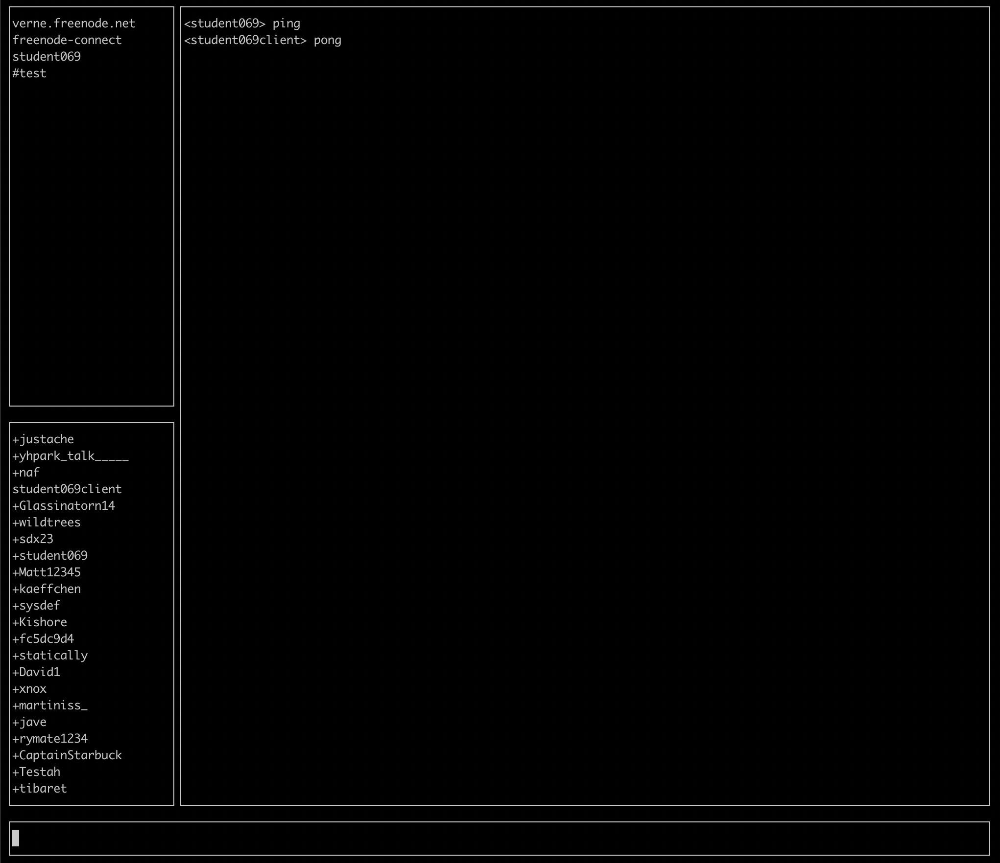

# Alpha-irc
Making an irc client to learn Golang more

# Screenshot

# Status

Can connect to freenode and send IRC messages using protocol spec

Keys

- `Escape` to switch view to channel list
- `Backspace` to delete channel
- `Tab` to autocomplete name to user in channel
- `Enter` to join channel

# TODO List

- [X] Ping / pong
- [X] handle messaging
  - [X] Recieve messages
  - [X] Send "raw" irc messages (PRIVMSG nick :message)
  - [x] join channel and talk there
  - [x] clean up input
- [ ] Channels
  - [ ] leave channel
  - [ ] channel motd
- [ ] / commands
  - [x] /join
  - [x] /msg
  - [x] /nick (sorta)
  - [ ] /query
- [ ] GUI (maybe tui)
  - [X] Add basic setup for input message
  - [X] Get better structure with channel list and members
  - [ ] clean up
- [ ] Config yaml
- [ ] Get a good repo structure in place
